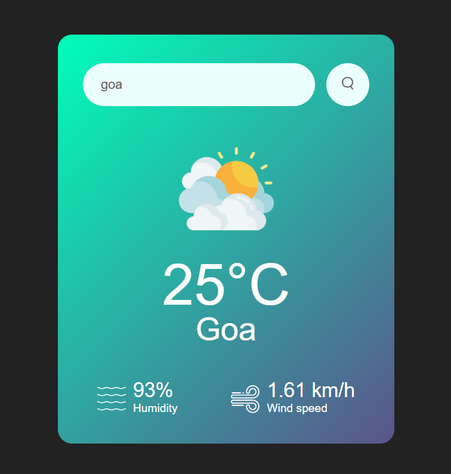

# PRODIGY_WD_04
This repository includes one of the tasks i.e., a "Weather app" that I built during my internship at Prodigy Infotech as a Web Development intern.

## Weather App

This is a simple weather application built using HTML, CSS, and JavaScript. The application fetches weather data from the OpenWeatherMap API based on the user's location or a user-inputted location. It displays the current weather conditions, temperature, and other relevant information.

### Features

- Search for the weather in any city.
- Displays current temperature, weather condition, humidity, and wind speed.
- User-friendly interface with a clean and responsive design

## Project Link
Weather app: https://ankitbakshi10.github.io/PRODIGY_WD_04/

## Project Image

## Author
    @ankitbakshi10

## Date
    August 31, 2024